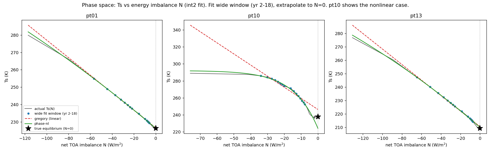

# Phase-space extrapolation: energy imbalance as the governing coordinate

Session note (2026-07-18), offline bake-off. Companion to
`tier0-hindcast-findings.md` §8 (the time-domain saturating step) and
`ml-learned-parameters.md`. **Offline analysis only; no core code changed.**
Driver: `../scratch/phase_space_bakeoff.py`.

## The idea being tested

Tier-0 §8 extrapolated the state against **time** (`Ts(t) = X_eq − A·e^(−t/τ)`,
step to `t → ∞`). That requires estimating `τ` and a time-asymptote from a short
window — ill-conditioned early (τ barely sampled) and, as shown below, unstable
near equilibrium (a flat window cannot constrain τ at all).

The alternative, motivated by the user: drop time as the independent variable and
work in **phase space**, with the net energy imbalance `N` (TOA, here
`energy_top`, W/m²) as the governing coordinate. Equilibrium is the physical
condition **`N = 0`**. Instead of extrapolating to `t → ∞`, fit the state as a
function of `N` and evaluate at `N = 0` — a *known x-value*, pinned by physics.

This is inspired by Gregory-style ΔN–ΔT regression (inferring equilibrium from a
short transient), but with the deliberate generalization that **the fit need not
be linear** — a saturating or otherwise curved `Ts(N)` may predict the endpoint
better when feedbacks are state-dependent (ice-albedo, deep-atmosphere
adjustment).

## The bake-off

Three predictors, each fitting only a window and predicting `Ts_eq` (= actual
final annual-mean Ts, the best available equilibrium proxy; these runs end with
residual `N ≈ −1.3` W/m²):

| predictor | form | endpoint |
|-----------|------|----------|
| `time-exp` | `Ts(t) = X_eq − A·e^(−t/τ)` (time domain, §8) | `X_eq` |
| `gregory`  | linear `Ts = c0 + c1·N` | `Ts(N=0) = c0` |
| `phase-nl` | curved `Ts(N) = T_eq − A·(1 − e^(N/N0))` | `Ts(0) = T_eq` |

Three fit-window regimes: **near-eq** (late 50 yr — the *clean end-state* jump),
**early** (yr 10–50 — already near N=0), **wide** (yr 2–18 — spans the
fast, high-imbalance early branch; the "jump from far out" test). Median absolute
`Ts_eq` error over the 15 cases, `int2` fit:

| regime | time-exp | gregory | phase-nl |
|--------|---------:|--------:|---------:|
| near-eq | 0.42 (mean **19.9**) | 0.92 | 1.08 |
| early   | 1.12 | **0.69** | 1.00 |
| wide    | 1.74 (mean **1.5e3**) | 0.29 | **0.15** |

(means in **bold** where they blow up: time-exp `max` reached 207 K near-eq,
2.3e4 K wide.)

## Findings

**1. Phase space beats the time domain decisively — the endpoint being pinned is
the whole point.** `time-exp` is not merely worse but *unstable*: when the fit
window is flat (near equilibrium) or short (wide), `τ` is unconstrained and `X_eq`
flies off (mean error 20 K near-eq, 1500 K wide, max 2.3e4 K). `gregory` and
`phase-nl` stay bounded and small in **every** regime, because extrapolating to
the fixed `N = 0` cannot run away the way extrapolating to `t → ∞` can. This is a
quantitative vindication of the premise: **energy imbalance is the more
fundamental coordinate than time** — the equilibrium condition lives on the
N-axis, not at infinite time. It also means the *clean end-state* use case (jump
from a nearly-converged run to true `N=0`) should use the phase-space fit, not the
time-domain one.

**2. Nonlinear beats linear where the physics is nonlinear — but only on smoothed
input.** On the wide window (the widest N-range, where curvature is real and
resolved), `phase-nl` (0.15 K) beats `gregory` (0.29 K) ~2×. Geometrically
(Fig 12): for most cases `Ts(N)` is strikingly linear and both fits nail the
`N=0` star; but **pt10 has a visibly concave `Ts(N)`** — there the linear Gregory
overshoots the endpoint while the curved fit bends with the true relation and
lands close. That is the ice-albedo feedback's state-dependence showing up as
phase-space curvature, exactly the case the linear special-case cannot handle.
This is the empirical support for *not limiting the method to linear regression*.

**3. The nonlinear advantage is conditional on smoothing.** With `native`
(unsmoothed) input, `gregory` (0.61) beats `phase-nl` (0.84) on the wide window —
the noisy fast early drop lets the curved form overfit spurious curvature. Only
with `int2` (long smoothing) does clean curvature emerge and `phase-nl` win. This
ties the phase-space direction to the longer-smoothing hypothesis
(`tier0-hindcast-findings.md` §4): **long smoothing is a prerequisite for
nonlinear phase-space extrapolation**, not just a nicety.

**4. In these cold cases the huge imbalance collapses fast** (N: −40 W/m² at
yr 5 → −5 by yr 20), so "jump from year 10" is, in phase-space terms, a *short*
extrapolation already near N=0 — which is why all methods do tolerably on the
early window. The genuinely long extrapolation is the wide (yr 2–18) window that
reaches back to the high-N branch; that is the real test of the asynchronous
ladder's first jump, and phase-space handles it (median 0.15–0.29 K) where time
domain fails.

*Fig 12 — `Ts` vs net imbalance `N`, `int2` fit. Blue = wide fit window (yr 2–18);
red dashed = linear Gregory; green = nonlinear `Ts(N)`; star = true equilibrium at
`N=0`. pt01/pt13 are near-linear (both fits succeed); pt10 is concave — Gregory
overshoots, the curved fit tracks.*

## Consequences for the method

- **Adopt phase-space (`state`-vs-`N`) as the extrapolation frame**, with `N = 0`
  the endpoint. The time-domain saturating step (§8) is its shadow — same physics,
  worse conditioning — and should be demoted to a fallback where an imbalance
  series is unavailable.
- **The fit family is pluggable and problem-class-specific.** Linear Gregory is
  the near-equilibrium / constant-feedback special case; a curved `Ts(N)` wins
  under state-dependent feedback (cold ice worlds); other classes (Earth-twins,
  mini-Neptunes) will want their own forms. This mirrors the existing
  `VariableConstraint` plugin pattern, one level up: **register the phase-space
  fit form per problem class.**
- **The gate generalizes to phase space.** Rather than "refuse when *time*
  curvature is large," the trustworthy-extrapolation test becomes "refuse when the
  `Ts(N)` relation changes character between the fit window and `N = 0`" — i.e. a
  detected kink in phase space, which *is* a feedback threshold (snowball
  bifurcation). This is a more physical gate than the time-domain curvature ratio.
- **This sharpens the ML note.** The learned target shifts from "infer τ" to
  "infer the phase-space feedback relation (its slope `λ`, and any curvature/kink)
  from a short burst + case descriptors" — a more physical and transferable target
  than a time constant.

## Open / next

- **A better nonlinear form.** The `1 − e^(N/N0)` form slightly overshoots past
  `N=0` on the concave case (pt10, Fig 12). A feedback-parameter model
  (`N = λ(T)·(T − T_eq)` with `λ` linear in `T`) or a two-parameter saturating
  form may tighten it and be more physically interpretable.
- **Wider validation.** Score against the other slow variables (energy_bot as a
  second imbalance coordinate; the ice reservoir) and with leave-one-run-out, per
  the ML note's discipline.
- **The residual-N endpoint bias.** Ground truth here is the final state at
  `N ≈ −1.3`, not true `N=0`; the ~0.15–0.3 K floor partly reflects that the runs
  never fully equilibrated. Real equilibria (or a longer reference run) would let
  us separate method error from endpoint bias.
- Everything above stays **offline**. The online run→jump→run harness (CLAUDE.md
  Open items O1/O2) remains out of scope; this note only establishes that the
  phase-space extrapolation is sound enough to eventually drive it.
