# Tier-0 offline hindcast: findings

Session-3 analysis (2026-07-17), scoring the tool's central claim against real
archived spinups without running the model or touching a restart file.

> **Status: preliminary, but with one strong conclusion.** The skill numbers and
> sweeps below are real and reproducible. The headline (§8): the equilibration
> approach is a *saturating relaxation*, so a linear forward-Euler step overshoots
> and a naive quadratic step overshoots worse — a saturating-exponential fit beats
> linear on every variable at every Δt (50–70× at Δt=100). §7 shows TS, TOA energy
> balance, and the ice reservoir form a single coupled equilibration mode
> (|r| > 0.9). Open items remain (§4 smoothing baseline; §5b per-category ice/snow
> data gap). No core defaults were changed on the strength of this pass.

> **The question Tier-0 answers:** given a slow-converging spinup, would a
> forward-Euler tendency extrapolation (`X_new = X + <dX/dt>·Δt`) have
> predicted where the simulation actually went — and does the trustworthiness
> gate refuse exactly the steps that would have missed?

**Data.** 15 cold-start ExoCAM cases (`exocam_ML_grp3_pt01..pt15`), 150 yr
each, reduced by `exocam-trend` to annual-mean global time series
(`_cam` + `_cice` streams). Analysis is pure computation over the `.txt` via
the `hindcast` module (`load_case` → `annual_mean_series` → `sweep_hindcasts`
→ `calibrate_gate` / `max_safe_dt` / `error_by_dt`). No netCDF, no model runs.

**Sweep.** windows {20, 30, 50 yr} × Δt {10, 20, 50, 100 yr} × origins every
10 yr, per case. 1290 hindcasts per variable. Fit input compared across the
`native` / `int1` / `int2` columns; scoring always against the `native`
annual mean (ground truth).

The exploration tooling that produced every figure is
`scratch/hindcast_viz.py` (three subcommands: `trajectory`, `gatemap`,
`threshold`) and `scratch/run_hindcast_sweep.py` (the tabular sweep). These
live in `scratch/`, not the library — they are analysis, not tool code, and
import the real pipeline so a plot shows what the tool would actually decide.

---

## 1. Headline: forward-Euler is accurate for surface temperature to ~50 yr

Surface temperature (`TS`, and the sea-ice-surface `Tsfc`) is the primary
acceleration target, and Tier-0 validates it cleanly. Accepted-hindcast
absolute error, pooled over all cases (native fit):

| Δt (yr) | median \|err\| (K) | p90 (K) | max (K) |
|--------:|-------------------:|--------:|--------:|
|      10 |               0.08 |    0.40 |     2.3 |
|      20 |               0.14 |    0.47 |     2.9 |
|      50 |               0.50 |    1.37 |     4.0 |
|     100 |               5.75 |    7.34 |     8.0 |

- To **Δt = 50 yr**, median error is 0.5 K and p90 is 1.4 K — inside a 2 K
  tolerance. Miss rate at 2 K tol is 4%.
- **Δt = 100 yr breaks down** (median 5.75 K), *and the gate starves it*: only
  4 of 296 accepted `TS` hindcasts survive to 100 yr. The data itself argues
  for a decreasing-Δt schedule that tops out near 50 yr steps — independent
  agreement with the Wordsworth 5×100→15×10 design intent, scaled to these
  150-yr records.

**Figure 2** (`fig2_accurate_acceleration_converged.png`) — pt13 at origin 70,
in slow near-linear decline (curv_ratio 0.35): the fitted tendency tracks the
actual slope, and the Δt=10/20 predictions land within 0.02–0.31 K of truth.
This is the tool's target regime.

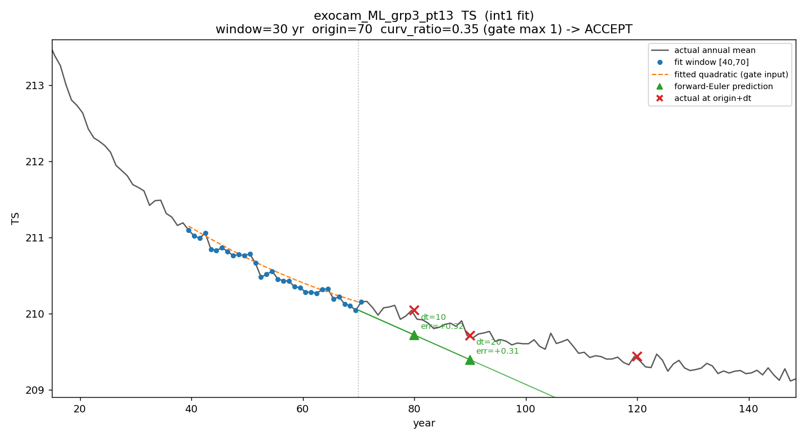

---

## 2. The gate works — and it errs on the side of refusing

The session-2 synthetic test suggested the gate might be *under*-refusing
(~0.37 miss rate) and need tightening. On real cold cases the opposite holds:
at the default `max_curvature_ratio = 0.5` the `TS` **miss rate is already
low** (0.19 → 0.08 → 0.04 as tol goes 0.5 → 1 → 2 K), while it **refuses a
large fraction of steps persistence alone would have gotten right**. The
default gate is too conservative, not too loose.

**Figure 1** (`fig1_gate_refuses_transient_knee.png`) is the gate earning its
keep. pt10 at origin 40, window 20: the fit window catches the *knee* where the
steep cold-start transient decelerates into its asymptote. The fitted quadratic
visibly bends (curv_ratio 1.42), so the gate **REFUSES** — correctly: a linear
extrapolation of the still-steep local slope would overshoot far below the
actual trajectory, which flattens at ~237–238 K. This is precisely the
"proximity to a nonlinear knee → refuse, don't shrink" principle, caught in
real data.

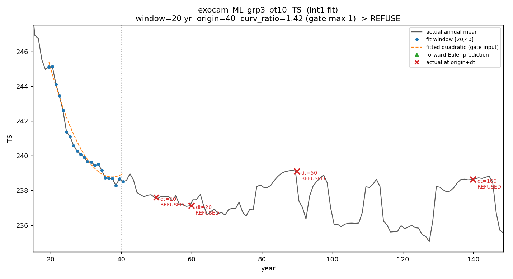

**Figure 3** (`fig3_gatemap_TS.png`) — the (origin, Δt) plane for pt10: error
is largest at early origin + large Δt (top-left), shrinks toward late origin /
small Δt, and the early-transient origins are refused (red hatch). The
trustworthiness structure the design predicts, made visible.

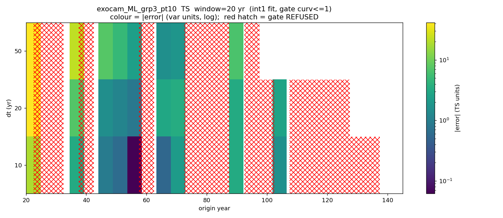

---

## 3. Recommended gate threshold: `max_curvature_ratio = 1.0`

Sweeping the threshold and pooling `TS` over all cases (int1 fit, tol 2 K,
Δt ∈ {10, 20, 50}):

| max_curvature_ratio | # accepted | # accepted-good | miss rate |
|--------------------:|-----------:|----------------:|----------:|
|                0.25 |        113 |             111 |      0.02 |
|         **0.50** (current default) |   287 |   283 |  0.01 |
|            **1.00** (candidate)    |   600 |   567 |  0.06 |
|                2.00 |        807 |             737 |      0.09 |
|                3.00 |        859 |             762 |      0.11 |
|                5.00 |        985 |             786 |      0.20 |

- **0.5 → 1.0 roughly doubles the accepted safe steps** (283 → 567
  accepted-good) at a miss cost rising only 0.01 → 0.06.
- Past **~2.5 the miss rate crosses 10%** and climbs steeply — that is the
  nonlinear-knee regime the gate exists to exclude.

**Candidate: raise the default `max_curvature_ratio` from 0.5 to 1.0** — the
point that recovers most of the safe acceleration while keeping the `TS` miss
rate under 6% (`2.0` is a defensible aggressive edge, miss < 10%; above that,
don't). Held, not applied: the curvature ratio the gate measures depends on how
the fit input is smoothed, so this must be re-confirmed on the smoothing baseline
chosen in §4 before it becomes a default.

**Figure 4** (`fig4_threshold_tradeoff_TS.png`) — the tradeoff curve: green
(#accepted-good) rises steeply then plateaus; red (miss rate) stays under the
10% line until ~2.5. Their separation is widest around ratio 1–2.

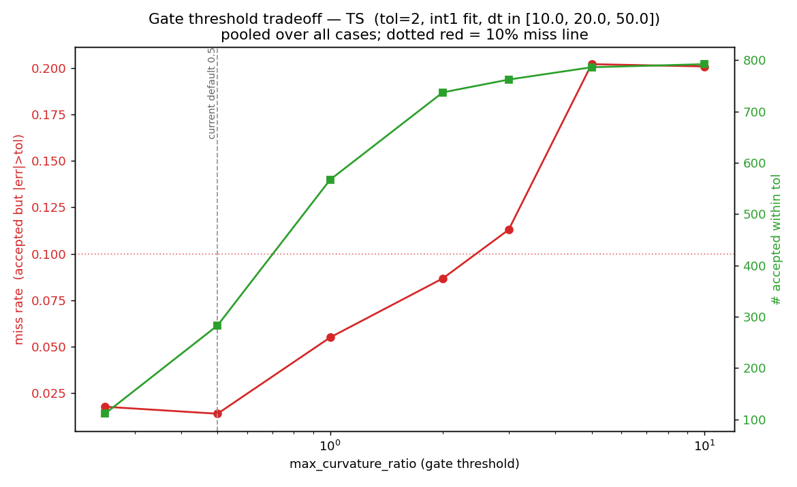

> **Caveat on the false-alarm metric.** `false_alarm_rate` stays pinned near
> 0.98 across all thresholds because much of each 150-yr record is already
> near-converged: for those origins "do nothing" is within tolerance, so any
> refusal there scores as a false alarm regardless of the threshold. The
> meaningful tuning pair is therefore **(miss rate, #accepted-good)**, not the
> false-alarm rate, on these already-cold cases.

---

## 4. Fit input: smoothing baseline is an OPEN parameter (lean longer)

Smoothing the fit input matters, but this pass did **not** settle the right
window. What the three available columns showed:

- `native` (monthly) carries the full interannual noise; the quadratic
  curvature term picks it up and the gate over-reacts.
- `int1` is currently only a **1-year** running mean — still visibly noisy for
  `TS` and energy-balance vs. time. It modestly beats native
  (`TS` miss 0.19 → 0.18 at 0.5 K tol) but is not smooth enough to trust as
  the default.
- `int2` (longer running mean) raises accepted count further but, at its
  current setting, produced rare large `Tsfc` outliers (max ~45 K at Δt=50)
  from end-of-window smoothing artifacts.

**Working hypothesis (Wolf):** a substantially longer smoothing baseline —
`int2 = 12 yr`, or longer — will track the slow `TS` / energy-balance drift
better than either the 1-yr `int1` or `native`, because the quantity being
extrapolated is a multi-decadal approach to equilibrium, not annual weather.
The end-of-window artifacts seen in the current `int2` are likely a symptom of
too-short / edge-biased smoothing, not of long smoothing per se.

**Action (open):** treat the smoothing-window length as a swept parameter in
the next pass — regenerate the trend series with `int2` at 12 yr (and try 20+),
re-run the skill/threshold sweep against each, and pick the window that
minimizes `TS` and energy-balance tracking error *and* keeps end-of-window bias
controlled. Do **not** hard-default to `int1` on the strength of this pass.

---

## 5a. Sea-ice thickness (`hi`) is a far-from-equilibrium *deceleration*, not noise

`hi` has a high miss rate that no gate threshold rescues:

| max_curvature_ratio | miss rate (0.5 m tol) |
|--------------------:|----------------------:|
|                0.25 |                  0.35 |
|                1.00 |                  0.51 |
|               10.00 |                  0.51 |

But the dedicated `_cice` sweep (§6) shows *why*, and it is **not** what the
`TS`-session pass assumed ("threshold-driven / dynamical noise"). `hi` here is a
**smooth, monotonic growth toward a still-distant equilibrium that is
decelerating** (Figure 6): the ice sheet is thickening ~20 m over the run and
the growth rate is easing as it approaches balance. Forward-Euler rides the
local tangent straight while the true curve bends below it, so error is a
**systematic overshoot that grows with Δt** — small at Δt=10 (median 0.2 m),
large at Δt=50 (median 2.6 m). It is not random; it is the signature of
extrapolating a variable that is far from equilibrium.

The gate does not catch it because over any single 20–50 yr window the curvature
is *locally* small (curv_ratio ~0.2 in Figure 6) even though the multi-decade
extrapolation overshoots — so the gate accepts and the 0.5 m tolerance is
breached. The lesson is not "the gate is broken" but "the linear model is the
wrong model for a reservoir this far from equilibrium." `hi` belongs to the
**aqua-ice plugin / pointwise path** (and the still-open O7 frozen-regime
reference set) with a model that can represent the approach-to-saturation, not
the per-layer linear default.

**Figure 5** (`fig5_hi_untunable.png`) — `hi` miss rate flat and high across
the whole threshold sweep, in contrast to Figure 4's tunable `TS`.

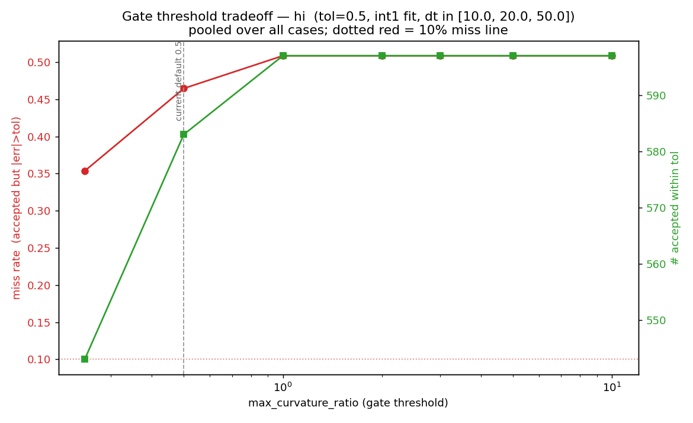

---

## 5b. The TS / energy-balance trend must be validated *jointly* with sea-ice/snow

This is the constraint that makes single-variable `TS` skill (§1) necessary but
**not sufficient** for these cold-planet regimes, and it is the most important
open item from this session.

Empirically (Wolf), applying an asynchronous-restart scaling for a cold planet
does not touch surface temperature in isolation — it moves the **sea-ice and
snow reservoirs**. The reference prototype `accelerate.py --aqua_ice` makes this
concrete: it scales exactly four CICE restart fields by a single `fice` factor,

    eicen   sea-ice enthalpy   (per thickness category)
    esnon   snow    enthalpy   (per category)
    vicen   sea-ice volume     (per category)
    vsnon   snow    volume      (per category)

and touches `Tsfcn` on the ice. So the physical acceleration couples surface
temperature and top-of-atmosphere energy balance to the ice/snow enthalpy and
volume. A defensible tool must therefore verify that a proposed `TS`/energy step
**correlates with a consistent step in `eicen, esnon, vicen, vsnon`** — you
cannot advance the temperature trend and leave the frozen reservoir behind, or
vice versa, without violating energy conservation. This is exactly the job the
design assigns to the aqua-ice **`VariableConstraint` plugin** (enforce ice ≥ 0,
conserve total water mass) and the post-step **consistency hook** — Tier-0 now
gives them a concrete acceptance criterion: joint TS ↔ (ice/snow enthalpy,
volume) tracking.

**Data gap blocking this.** The current trend `.txt` does **not** contain these
four fields. The `_cice` stream carries only aggregate proxies — `hi, hs`
(thickness), `qi, qs` (enthalpy-like), `vicen005` (volume of *one* category,
#5), `Tsfc`. To score the TS ↔ ice/snow coupling we need `exocam-trend` (or a
small derived-quantity step) to emit **`eicen, esnon, vicen` (all categories),
`vsnon`** as time series — ideally the per-category totals plus their sums.
Until then, the joint validation in this section cannot be computed; the
single-variable `TS` skill above stands, but is not the whole test.

---

## 6. The six `_cice` variables, swept individually

Same sweep (windows {20,30,50}, Δt {10,20,50,100}, origins every 10 yr, 1290
hindcasts each, default gate 0.5, native fit) applied to every variable the
`_cice` stream currently carries. Median accepted \|error\| and the miss rate at
the tolerance nearest a few-percent of each variable's dynamic range:

| var | units | typ. range | drift(20→end) | med\|err\| Δt10 | med\|err\| Δt50 | miss @ tol |
|-----|-------|-----------:|--------------:|----------------:|----------------:|-----------:|
| `hi`       | m | ~30    | **+20.6** | 0.21    | 2.6     | 0.35 @0.5 m |
| `vicen005` | m | ~30    | **+20.6** | 0.21    | 2.7     | 0.36 @1 m   |
| `hs`       | m | ~1.7   | +1.4      | 0.0014  | 0.006   | 0.10 @0.1 m |
| `qi`       | J | ~4e21  | −2.8e21   | 2.7e19  | 3.3e20  | 0.40 @1e20 J|
| `qs`       | J | ~9e19  | −7.3e19   | 5.1e16  | 3.1e17  | 0.13 @4e18 J|
| `Tsfc`     | °C| ~32    | −2.4      | 0.09    | 0.54    | 0.05 @2 °C  |

Three regimes emerge:

**(a) The frozen reservoir — `hi`, `vicen005`, `qi` — grows large and
decelerates.** These three are the *same physical thing* (ice volume, its
category-5 slice, and its enthalpy) and their curves are near-identical
(Figures 6, 7): a smooth +20 m / −2.8e21 J monotonic growth over the run,
decelerating toward a distant equilibrium. Short-Δt hindcasts are fine; large-Δt
overshoot systematically (the §5a mechanism). The gate does **not** refuse them
(Figure 8: no red hatch anywhere) because each window is locally near-linear.
These are the fields `accelerate.py --aqua_ice` actually scales — and Tier-0
says a straight linear extrapolation of them overshoots at the Δt values that
make acceleration worthwhile. They need the approach-to-saturation model, not
the linear default.

**(b) Snow — `hs`, `qs` — small and well-behaved.** Snow depth and snow
enthalpy are ~an order of magnitude smaller reservoirs and track well: `hs`
median error 1.4 mm at Δt=10, and miss rate falls to 0.10 at a 0.1 m tolerance.
`qs` similar. Snow is close enough to its (small) equilibrium that linear
extrapolation is adequate; the high false-alarm rate (0.75–0.95) says the gate
is, as with `TS`, over-refusing these.

**(c) `Tsfc` (ice-surface temperature) behaves like `TS`.** It is the best of
the six: median 0.09 K at Δt=10, 0.54 K at Δt=50, miss rate 0.05 at 2 °C — the
same near-linear-approach skill as the atmospheric `TS` in §1, which makes
sense (it is the surface-temperature field on the ice). It is a legitimate
linear-pipeline target.

**Physical-consistency corroboration.** That `hi`, `vicen005`, and `qi` move as
one (same shape, same sign of drift, same deceleration) is exactly the
volume ↔ enthalpy coupling §5b requires. This is encouraging for the joint
validation — but note these are still *aggregate/proxy* fields, not the
per-category `eicen/esnon/vicen/vsnon` the plugin must conserve; the §5b data
gap stands.

**Figure 6** (`fig6_hi_decel_overshoot.png`) — `hi` on pt13: clean growth,
gate accepts (curv 0.18), predictions good to Δt=20 then overshoot at Δt=50.

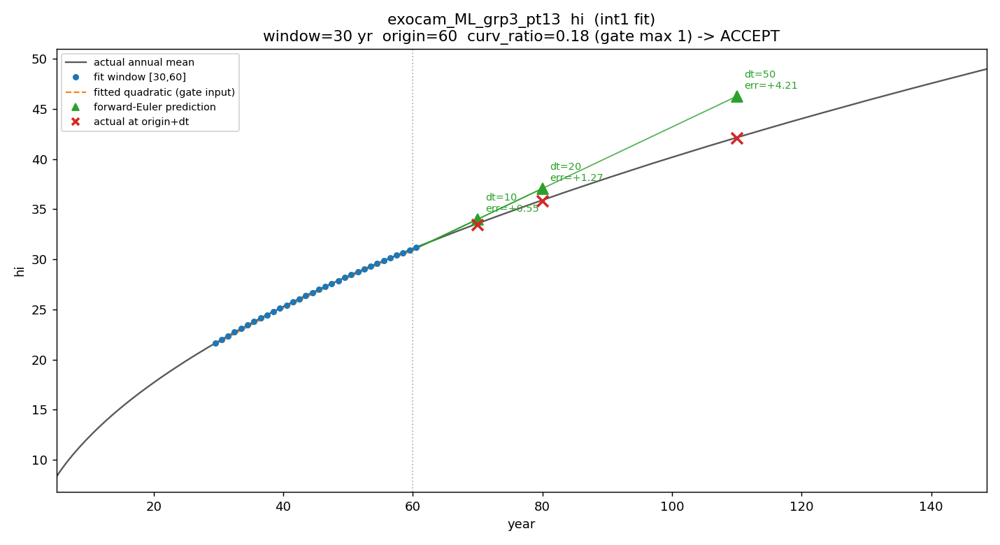

**Figure 7** (`fig7_qi_tracks_hi.png`) — `qi` (ice enthalpy) on the same case:
identical shape to `hi`, confirming the reservoir moves as one.

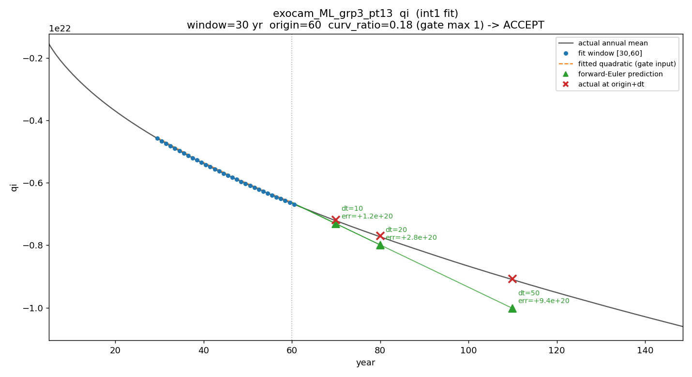

**Figure 8** (`fig8_gatemap_hi_no_refusal.png`) — `hi` (origin, Δt) plane: error
grows smoothly with Δt and toward early origins, and the gate refuses *nothing*
— the deceleration overshoot is invisible to a per-window curvature check.

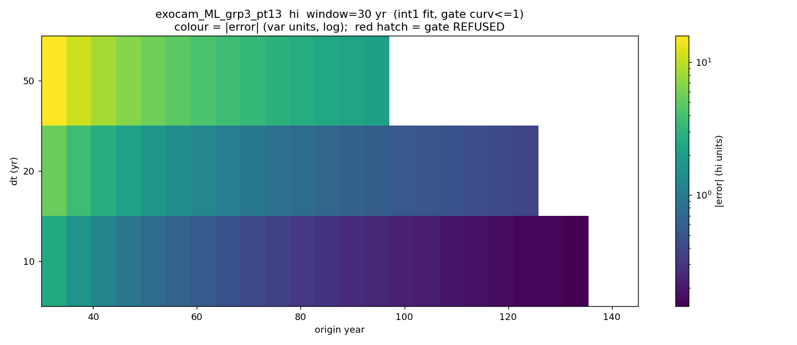

---

## 7. TOA energy balance, and the single coupled equilibration mode

**`energy_top` is the net TOA imbalance (W/m²); equilibrium is `energy_top → 0`,**
so it is the master convergence diagnostic. Swept like the rest
(`run_energy_sweep.py`):

| var | med\|err\| Δt10 (native) | med\|err\| Δt10 (int2) | miss @0.5 (native→int2) |
|-----|------------------------:|-----------------------:|:-----------------------:|
| `energy_top` | 0.165 | **0.052** | 0.27 → 0.14 |
| `energy_bot` | 0.131 | 0.047 | 0.22 → 0.13 |
| `FLNT`       | 0.102 | 0.053 | 0.24 → 0.19 |
| `FSNT`       | 0.089 | 0.074 | 0.28 → 0.18 |

Two results. First, **`int2` smoothing helps most exactly here** — it cuts the
Δt=10 `energy_top` error 3× (0.165 → 0.052 W/m²) and nearly halves the miss
rate. The TOA imbalance is the noisiest of the slow variables, so the longer
baseline (§4) pays off most on it — direct support for the longer-smoothing
hypothesis. Second, the imbalance closes through the **longwave**: `FLNT` (OLR)
carries the drift while `FSNT` (absorbed SW) is near-flat forcing plus noise
(worst skill of the four, and unsafe to extrapolate on its own).

**The equilibration is one coupled mode.** Correlating the standardized
annual-mean anomalies over the equilibration tail (yr 40–140) across all twelve
variables (`correlate_trends.py`) gives Figure 9. The slow drift is dominated by
a single eigenmode:

- `TS` ↔ `Tsfc` = **1.00**; `TS` ↔ `FLNT` = **0.94** — cooling drops OLR in lockstep.
- `TS` ↔ `energy_top` = **−0.92** — as the planet cools, the TOA imbalance
  closes toward zero.
- `TS` ↔ `hi`/`vicen005` = **−0.92**, `TS` ↔ `qi` = **+0.92**, and
  `hi`↔`vicen005`↔`qi` = **±1.00** — cooling ⟺ ice growth ⟺ ice-enthalpy drop,
  the reservoir moving as one body.
- **`energy_top` ↔ `hi` = +0.97** — the residual energy deficit is consumed by
  growing ice. This is the §5b coupling, now *measured*: TOA balance and the ice
  reservoir are the same story.

`FSNT` (0.45) and `LHFLX` (0.30) are the only weak participants — expected, they
are not part of the slow cooling mode. **Consequence:** because TS, TOA balance,
and the ice reservoir are ~collinear along the approach, a consistent
acceleration can in principle be driven from **one master coordinate**
(`energy_top` or `TS`) with the others slaved to it — and any per-variable step
that breaks these correlations is physically inconsistent and should be rejected.

**Figure 9** (`fig9_correlation_matrix.png`) — the trend-correlation matrix; the
TS / energy_top / ice block at |r| > 0.9 is the coupled equilibration mode.

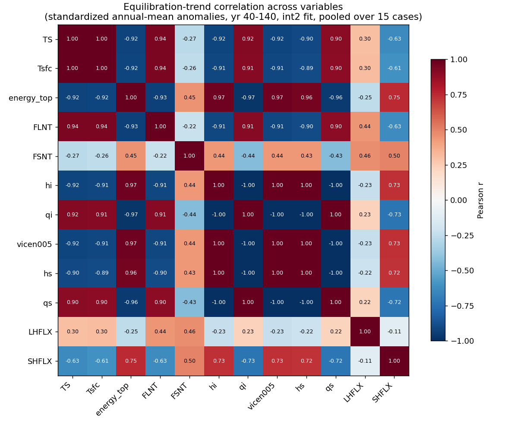

---

## 8. The step must be a *saturating* fit, not a linear (or polynomial) Euler step

The user's call — "a linear-in-time Euler step will not work; fit curves and
step accordingly" — is confirmed, with an important refinement about *which*
curve.

**Why linear fails.** Over the equilibration tail the quadratic contribution is
comparable to the linear one for the core variables — median curvature-ratio
(|quad change|/|linear change|, yr 40–140) is **0.96 (TS), 0.99 (energy_top),
1.06 (FLNT)**. A straight tangent step therefore overshoots by an amount that
grows with Δt, catastrophically at Δt=100 (linear median error: **71 K (TS),
65 W/m² (energy_top)**).

**Why a raw polynomial step also fails.** A quadratic Taylor step
`X + b·Δt + c·Δt²` (with `b, c` from the same fit the gate uses) is *worse than
linear at every Δt* on every variable tested. Local curvature fitted on an early,
steeply-bending window, then carried forward as `c·Δt²`, runs away — it
overshoots in the *opposite* direction (Figure 10). High-order polynomial
extrapolation is unstable for exactly this reason.

**What works: a saturating (exponential-relaxation) model.** The physical
trajectory is a *relaxation toward an asymptote*, `X(t) = X_eq − A·e^(−t/τ)`,
which bends toward equilibrium and cannot overshoot it. Fitting that on the same
window and stepping along it beats linear at **every variable and every Δt**,
decisively where linear breaks (median \|error\|, int2 fit, pooled):

| var | Δt=50 lin → exp | Δt=100 lin → exp |
|-----|:---------------:|:----------------:|
| `TS`         | 1.14 → **0.34** K   | 71 → **1.4** K    |
| `energy_top` | 1.39 → **0.36** W/m²| 65 → **2.0** W/m² |
| `FLNT`       | 1.30 → **0.47**     | 67 → **2.0**      |
| `Tsfc`       | 1.07 → **0.33** K   | 47 → **1.3** K    |
| `hi`         | 3.79 → **1.28** m   | 21 → **7.5** m    |

At Δt=100 the saturating fit turns a 50–70× linear blow-up into an ~1–2 unit
error. **Implication for the schedule:** the decreasing-Δt schedule exists
because *linear* steps break past ~50 yr; a saturating step stays accurate at
Δt=100+, so with this model the schedule can be far more aggressive (fewer,
larger jumps) — potentially the biggest efficiency win in the whole tool.

Caveats: the single-exponential slightly under-predicts `hi` at large Δt
(Figure 11, left) — a two-timescale or asymptote-constrained fit may do better,
and the fit needs its own trustworthiness guard (reject non-physical `X_eq`, or
`τ` outside a sane band). But the direction is unambiguous: **replace the
forward-Euler core with a saturating-relaxation step; keep the gate and clip as
guards around it.**

**Figure 10** (`fig10_quadratic_overshoots.png`) — the naive quadratic step
(green) overshoots *below* the truth while linear (red) overshoots above; the
Taylor polynomial is not the fix.

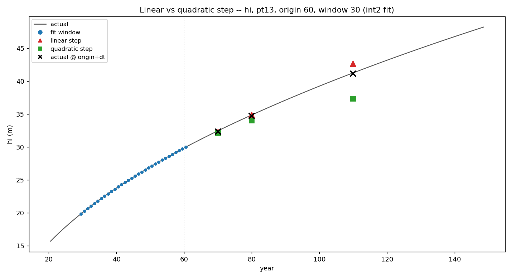

**Figure 11** (`fig11_linear_vs_exp.png`) — linear (red dashed) diverges from the
actual curve on both `hi` (up) and `TS` (down); the saturating-exponential
(green) hugs the true trajectory to year 100+ and lands on the actual-future
marks.

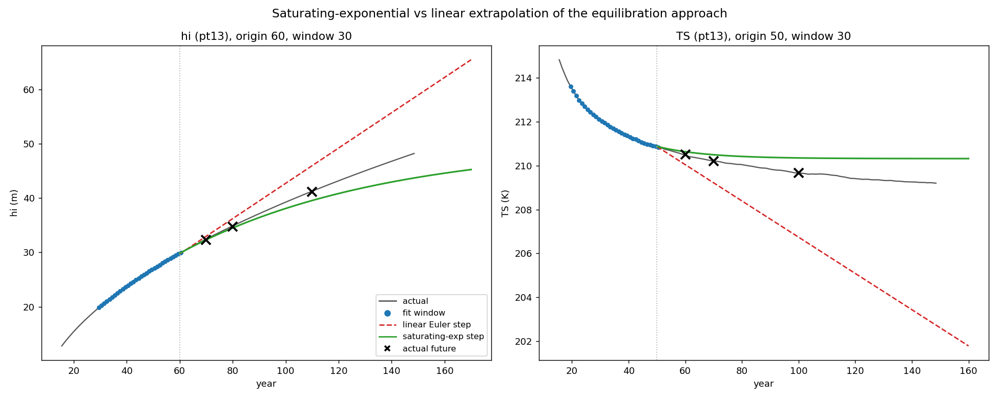

---

## 9. Where this leaves us

**The central design change this analysis forces:**

1. **Replace the forward-Euler core with a saturating-relaxation step (§8).**
   `X(t) = X_eq − A·e^(−t/τ)` beats linear on every variable at every Δt, and by
   50–70× at Δt=100. Linear (and a naive quadratic Taylor step) overshoot because
   the approach to equilibrium is a relaxation, not a drift. This is new design —
   a new fit family in `trends.py`, a new stepper path, and its own guard
   (reject non-physical `X_eq`/`τ`) — and it is the highest-value item here.
2. **The schedule may not need to decrease (§8).** The decreasing-Δt schedule
   exists because *linear* steps break past ~50 yr; a saturating step stays
   accurate at Δt=100+. Re-evaluate the schedule once the new stepper exists —
   potentially the biggest efficiency win in the tool.

**Supported, but re-confirm on the new stepper / smoothing baseline:**

3. **Gate threshold `max_curvature_ratio` ≈ 1.0** (§3) — but note the gate is a
   *linear*-model guard (it refuses when curvature is large). Under a saturating
   step the curvature is *expected*, so the gate's role changes from "refuse
   curved approaches" to "refuse ill-conditioned saturating fits." Rework
   alongside item 1; do not tune the linear-gate threshold as if it were final.
4. **Variable routing (§5a, §6, §7).** The saturating step likely serves *all*
   the slow variables (`TS`, `Tsfc`, `energy_top`, `FLNT`, and the frozen
   reservoir `hi`/`vicen`/`qi`), since they share one equilibration mode (§7).
   Snow (`hs`/`qs`) is near equilibrium and adequately linear. `FSNT`/`LHFLX` are
   forcing/noise — not extrapolation targets.
5. **Drive from a master coordinate (§7).** TS, `energy_top`, and the ice
   reservoir are collinear along the approach (|r| > 0.9), so one coordinate can
   drive a consistent multi-variable step, with the correlation itself as the
   post-step consistency check (reject steps that break it).

**Open data / validation dependencies:**

6. **Smoothing baseline (§4).** Regenerate trends with a longer `int2`
   (12 yr, then 20+); `int2` already helps `energy_top` most (§7). Settle the
   window before finalizing any fit default.
7. **Joint TS ↔ ice/snow validation (§5b).** Requires `exocam-trend` to emit
   `eicen, esnon, vicen` (all categories), `vsnon`. The `_cice` and correlation
   results (§6, §7) are encouraging — the reservoir moves as one, r(energy_top,
   hi)=0.97 — but those are aggregate/proxy fields, not the per-category
   quantities the plugin must conserve. **Still the gating data dependency.**

Nothing here is committed to core code yet; this document records the state so
the next pass starts from these findings, not from the `TS`-only linear view.
